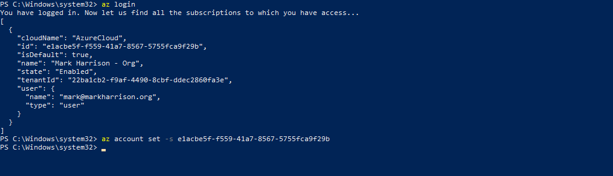

# Azure Container Instances - Hands-on Lab Script

Mark Harrison : checked & updated 14 March 2020 - original 24 Nov 2017


## Overview

Azure Container Instances offers the fastest and simplest way to run a container in Azure, without having to provision any virtual machines and without having to adopt a higher-level service.

## Login

If neccessary - login and (if multiple subscriptions) select required subscription:

```text
az login 
az account set -s <subscriptionid>
```



## Create Container Instance

All Azure resources must reside with an Azure resource group.

- Invoke the following to create the resource group - and set up the default to save typing on each subsequent command:
  - Amend the resource group name to that required - and in the subsequent instructions
  - Amend the location to that require (check ACI is available)

```text
az group create --name ACI-rg --location northeurope
az configure --defaults group=ACI-rg
```


We can create a container using the `az container create` command.  This will specify a Docker image located in a container registry such as the Docker hub or the Azure Container Registry.

- Invoke the following:
  - Amend the container name to that required - and in the subsequent instructions
  - Optionally - use your own image

```text
az container create --name markharrisonc1 --image markharrison/colorapi:v1 --ip-address public --ports 80
```


## Monitoring

We can see the provisioning state of the container using the `az container show` command.  The container will originally be in a Pending state - it will be pulling down the image from the registry. When provisioned it will be in a state of Succeeded.

- Invoke the following:
  - Amend the container name to that required

```text
az container show --name markharrisonc1
```

Creating:


Created:


The output will give the IP address of the container.  We can then browse to it (append `/swagger`) i.e. (in my case) <http://51.104.136.104:80/swagger>


If we have multiple container, we can see them all using the `az container list` command.

- Invoke the following:

```text
az container create --name markharrisonc2 --image markharrison/colorweb:latest `
        --ip-address public --ports 80

az container list -o table
```


We can examine the logs for the container using the `az container logs` command.

```text
az container logs  --name markharrisonc1
```


Events and Logs can also be inspected via the Azure management portal:


## Inside the container

We can execute a command in a running Azure container - for example, to start a bash shell:

```text
az container exec --name markharrisonc1  --exec-command "/bin/bash"  
ls -l
```


Or in the Azure management portal:


## Delete Container Instance

Finally tidy up - using the `az container delete` command.

- Invoke the following:

```text
az container delete --name markharrisonc1 -y
az container delete --name markharrisonc2 -y

az group delete --name ACI-rg  -y
```

---
<http://github.com/markharrison>
